<div align="center">


<br/>

<a href="https://www.linkedin.com/in/juanlesmes777"></a>
&nbsp;
<a href="mailto:juanfernandolesmescastaneda@gmail.com"></a>
&nbsp;
<a href="https://github.com/JuanLesmes?tab=repositories"></a>
&nbsp;


<br/><br/>

<sub>🇪🇸 Español &nbsp;|&nbsp; 🇬🇧 <i>English in italics</i></sub>

</div>


## 🧭 Sobre mí · About me

```bash
$ curl -s https://github.com/JuanLesmes/api/about | jq
```

```json
{
  "status": 200,
  "name": "Juan Fernando Lesmes Castañeda",
  "role": ["Software Engineer", "Software Developer"],
  "education": "Ingeniería de Sistemas · Pontificia Universidad Javeriana · 2025",
  "based_in": "Bogotá, Colombia 🇨🇴",
  "open_to": ["backend / full-stack roles", "AI engineering"],
  "likes": ["software que resuelve problemas reales", "CR7", "Felicilandia"]
}
```

Ingeniero de Sistemas. Lo que más me gusta es construir soluciones para problemas de la vida real y seguir todo el proceso de principio a fin: entender el problema, diseñar la arquitectura y elegir las tecnologías, desarrollar la solución y llevarla a producción. Me gusta el software rápido de usar, fácil de mantener y que sigue funcionando aunque se caiga el internet.

*Software Engineer. What I enjoy most is building solutions to real-life problems and following the whole process end to end: understanding the problem, designing the architecture and choosing the tools, building the solution and taking it to production. I like software that is fast to use, easy to maintain, and keeps working when the internet goes down.*


## 🧰 Stack

<div align="center">


</div>

| &nbsp; | Herramientas · Tools |
|:--|:--|
| ⚙️ **Backend** | Python 3.12 · FastAPI · Pydantic v2 · TypeScript · Node.js · pytest |
| 🖥️ **Frontend** | Angular · Next.js (App Router, RSC) · React · SCSS · RxJS · PWA / service workers |
| 🗄️ **Datos · Data** | PostgreSQL · SQLite (modo WAL) · diseño de esquemas · *schema design* |
| 🚀 **Infra & DevOps** | Docker Compose · Caddy + Let's Encrypt · Cloudflare DNS · VPS Ubuntu · Backblaze B2 · PowerShell |
| ☁️ **Cloud** | AWS · Azure |
| 🧩 Métodos · Methods | Scrum · Kanban · Jira |


## 🏆 Proyectos de los que estoy orgulloso · Projects I'm proud of

<div align="center">



</div>

<table>
<tr>
<td width="50%" valign="top">

### 🥇 Administrador de procesos jurídicos
<sub>Alianza Jurídica · integración con la API de la Rama Judicial · <i>Legal case manager · judicial-branch API integration</i></sub>

**Por qué estoy orgulloso:** tomé el sistema que la firma usaba todos los días y lo rediseñé desde cero, con ownership completo: arquitectura, backend, frontend, seguridad, pruebas, despliegue y operación en producción. La pieza clave fue integrar la API de consulta de procesos de la Rama Judicial (CPNU), una API pública sin documentación: búsqueda por radicado, detalle del proceso y actuaciones paginadas, con deduplicación, tolerancia a fallos y tiempos de espera controlados. Lo que antes era consultar expediente por expediente a mano, hoy se importa solo. Todo respaldado por 116 pruebas automatizadas.

*<b>Why I'm proud:</b> I took the system the firm used every day and rebuilt it from scratch, owning it end to end: architecture, backend, frontend, security, tests, deployment and production operations. The key piece was integrating Colombia's judicial-branch case-lookup API (CPNU), a public but undocumented API: search by case number, case detail and paginated proceedings, with de-duplication, fault tolerance and controlled timeouts. What used to be a manual, case-by-case lookup now imports itself. All backed by 116 automated tests.*

    

</td>
<td width="50%" valign="top">

### 🥈 Sistema POS + ERP para negocios MIPYME
<sub>Producto comercial · <i>Commercial product · POS + ERP for small businesses</i></sub>

**Por qué estoy orgulloso:** es el sistema donde más decisiones de arquitectura tomé pensando en el largo plazo. Monolito modular; un ledger inmutable para los movimientos de stock y contabilidad, donde cada movimiento queda registrado y nada se sobreescribe; e idempotencia en toda operación que cambia estado. El punto de venta es una PWA offline-first: la caja sigue vendiendo aunque se caiga el internet y, cuando vuelve la conexión, sincroniza sin duplicar nada. Incluye control de caja e integración con periféricos por Web Serial, WebUSB y Web Bluetooth.

*<b>Why I'm proud:</b> this is the system where I made the most architecture decisions with the long term in mind. A modular monolith; an immutable ledger for stock and accounting movements, where every movement is recorded and nothing is overwritten; and idempotency on every state-changing operation. The point of sale is an offline-first PWA: the register keeps selling when the internet goes down and, once the connection is back, syncs without duplicating anything. It also handles cash control and peripherals over Web Serial, WebUSB and Web Bluetooth.*

   

</td>
</tr>
<tr>
<td colspan="2" valign="top">

### 🥉 RecetarioVEG
<sub>📂 <a href="https://github.com/JuanLesmes/RecetarioVEG">Ver repositorio · View repo</a> · <i>Vegan & vegetarian recipe app</i></sub>

**Por qué estoy orgulloso:** es un proyecto personal que resuelve un problema cotidiano: qué cocinar con lo que ya hay. Son 121 recetas veganas y vegetarianas pensadas para Colombia, con los ingredientes como se piden en la plaza, un buscador por lo que tienes en la nevera, lista de mercado y planificador semanal. El código es público en GitHub.

*<b>Why I'm proud:</b> a personal project that solves an everyday problem: what to cook with what you already have. 121 vegan and vegetarian recipes made for Colombia, with ingredients as you'd ask for them at the market, a search by what's in your fridge, a shopping list and a weekly planner. The code is public on GitHub.*


</td>
</tr>
</table>

<details>
<summary><b>📂 Más proyectos · More work</b></summary>

- 📦 **[GestionInventario](https://github.com/JuanLesmes/GestionInventario)** y **[InventarioApp](https://github.com/JuanLesmes/InventarioApp)** — dos apps de escritorio para gestionar inventarios: una en Python (patrón MVC, interfaz gráfica y SQLite embebida) y otra en C#. · *Two desktop inventory apps: Python (MVC, GUI, embedded SQLite) and C#.*
- 🌐 **Sitios web corporativos** — Imperio Real Abogados (Next.js 14, App Router, React 18) y Psyconova (Angular 21, SCSS, RxJS), con canal de contacto directo por WhatsApp. · *Corporate websites with a direct WhatsApp contact channel.*

</details>


## 📍 Ahora · Now

- 💼 Desarrollador Junior en **Inetum**· *Junior Developer at Inetum*
- 🚀 Construyendo soluciones que generen impacto real en negocios y personas · *Building solutions that make a real impact on businesses and people*
- 📚 Aprendiendo: agentes de IA con LangGraph y Amazon Bedrock · *Learning: AI agents with LangGraph and Amazon Bedrock*
- 🤝 Abierto a roles backend y full-stack · *Open to backend and full-stack roles*
- 📬 Escríbeme · *Reach out:* [juanfernandolesmescastaneda@gmail.com](mailto:juanfernandolesmescastaneda@gmail.com)


## 📊 GitHub

<div align="center">

<picture>
  <source media="(prefers-color-scheme: dark)" srcset="https://github-readme-stats.vercel.app/api?username=JuanLesmes&show_icons=true&include_all_commits=true&hide_border=true&bg_color=0d1117&title_color=ffb347&icon_color=ff7a18&text_color=c9d1d9&rank_icon=github">
  
</picture>
<picture>
  <source media="(prefers-color-scheme: dark)" srcset="https://github-readme-stats.vercel.app/api/top-langs/?username=JuanLesmes&layout=compact&hide=tex&langs_count=8&hide_border=true&bg_color=0d1117&title_color=ffb347&text_color=c9d1d9">
  
</picture>

<picture>
  <source media="(prefers-color-scheme: dark)" srcset="https://streak-stats.demolab.com?user=JuanLesmes&hide_border=true&background=0d1117&ring=ff7a18&fire=ff3d77&currStreakLabel=ffb347&currStreakNum=ffffff&sideLabels=ffb347&sideNums=ffffff&dates=8b949e">
  
</picture>

### 🐍 Contribuciones · Contributions

<picture>
  <source media="(prefers-color-scheme: dark)" srcset="https://raw.githubusercontent.com/JuanLesmes/JuanLesmes/output/snake-dark.svg">
  
</picture>

</div>

<br/>

<div align="center">

<sub>Hecho con ☕ en Bogotá · <i>Made with ☕ in Bogotá</i></sub>


</div>
