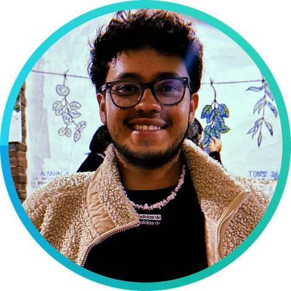

<div align="center">



# Juan Fernando Lesmes Castañeda



**Software Engineer · Backend Developer · Bogotá, Colombia**

<br/>

<a href="https://www.linkedin.com/in/juanlesmes777"></a>
&nbsp;
<a href="mailto:juanfernandolesmescastaneda@gmail.com"></a>
&nbsp;
<a href="https://github.com/JuanLesmes?tab=repositories"></a>
&nbsp;


</div>


## 🧭 About me

```bash
$ curl -s https://github.com/JuanLesmes/api/about | jq
```

```json
{
  "status": 200,
  "name": "Juan Fernando Lesmes Castañeda",
  "role": ["Software Engineer", "Software Developer"],
  "education": "Systems Engineering · Pontificia Universidad Javeriana · 2025",
  "based_in": "Bogotá, Colombia 🇨🇴",
  "open_to": ["backend / full-stack roles", "AI engineering"],
  "likes": ["software that solves real problems", "CR7", "Felicilandia"]
}
```

Software Engineer. What I enjoy most is building solutions to real-life problems and following the whole process end to end: understanding the problem, designing the architecture and choosing the tools, building the solution and taking it to production. I like software that is fast to use, easy to maintain, and keeps working when the internet goes down.


## 🧰 Stack

<div align="center">


</div>

| &nbsp; | Tools |
|:--|:--|
| ⚙️ **Backend** | Python 3.12 · FastAPI · Pydantic v2 · Java · Spring · Spring Boot · Node.js · TypeScript · pytest |
| 🖥️ **Frontend** | Angular · Next.js (App Router, RSC) · React · TypeScript · SCSS · RxJS · PWA / service workers |
| 🗄️ **Data** | PostgreSQL · SQLite (WAL mode) · schema design |
| 🚀 **Infra & DevOps** | Docker Compose · Caddy + Let's Encrypt · Cloudflare DNS · Ubuntu VPS · Backblaze B2 · PowerShell |
| ☁️ **Cloud** | AWS · Azure |
| 🧩 **Methods** | Scrum · Kanban · Jira |


## 🏆 Projects I'm proud of

<div align="center">


</div>


## 📍 Now

- 💼 Junior Developer at **Inetum**
- 🚀 Building solutions that make a real impact on businesses and people
- 📚 Learning: AI agents with LangGraph and Amazon Bedrock
- 🤝 Open to backend and full-stack roles
- 📬 Reach out: [juanfernandolesmescastaneda@gmail.com](mailto:juanfernandolesmescastaneda@gmail.com)


## 📊 GitHub

<div align="center">

<p align="center">
  <picture>
    <source media="(prefers-color-scheme: dark)" srcset="https://raw.githubusercontent.com/JuanLesmes/JuanLesmes/stats/stats-dark.svg">
    
  </picture>
  <picture>
    <source media="(prefers-color-scheme: dark)" srcset="https://raw.githubusercontent.com/JuanLesmes/JuanLesmes/stats/langs-dark.svg">
    
  </picture>
</p>

<p align="center">
  <picture>
    <source media="(prefers-color-scheme: dark)" srcset="https://streak-stats.demolab.com?user=JuanLesmes&hide_border=true&background=0d1117&ring=14b8a6&fire=22d3ee&currStreakLabel=2dd4bf&currStreakNum=ffffff&sideLabels=2dd4bf&sideNums=ffffff&dates=8b949e">
    
  </picture>
</p>

### 🐍 Contributions

<p align="center">
  <picture>
    <source media="(prefers-color-scheme: dark)" srcset="https://raw.githubusercontent.com/JuanLesmes/JuanLesmes/output/snake-dark.svg">
    
  </picture>
</p>

</div>

<br/>

<div align="center">

<sub>Made with ♡ in Bogotá</sub>


</div>
